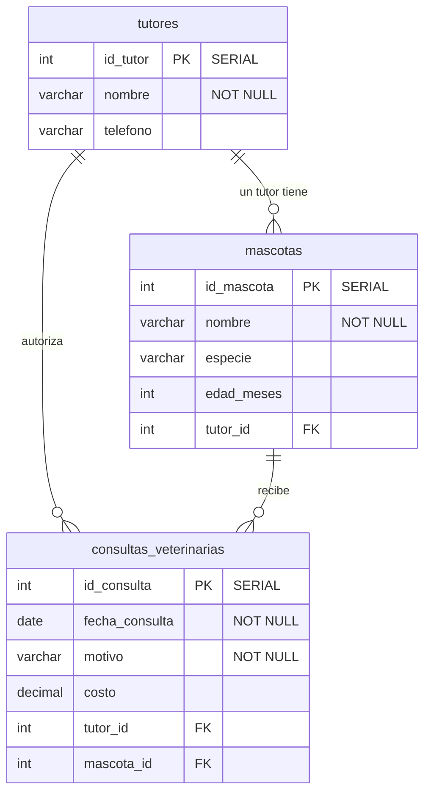

diagrama entidad-relación (ER) en formato **Mermaid**. 

Este diagrama representa visualmente las tres tablas que creamos, sus campos, los tipos de datos y cómo se conectan a través de las llaves foráneas.

---

### Explicación del diagrama para la clase:

* **`PK` (Primary Key)**: Identifica la llave primaria de cada tabla (los identificadores únicos autoincrementables).
* **`FK` (Foreign Key)**: Identifica las llaves foráneas, que son los campos que apuntan a otra tabla para crear el enlace.
* **Simbología de las líneas (`||--o{`)**:
* El lado con las dos líneas verticales (`||`) significa **Uno (1)**.
* El lado con la "pata de gallo" (`o{`) significa **Muchos (N)**.

analizando el diagrama:

1. **Un** tutor puede tener **muchas** mascotas.
2. **Un** tutor puede figurar en **muchas** consultas.
3. **Una** mascota puede tener **muchas** consultas a lo largo de su vida.