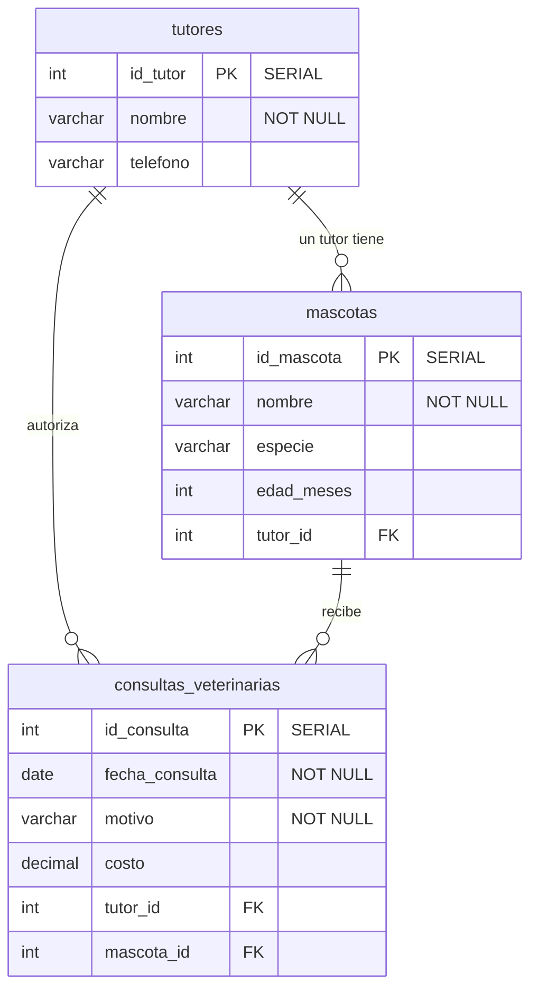

# Set 01 — Veterinaria 🐾

Una ruta guiada para aprender SQL desde cero, paso a paso. Cada ejercicio es pequeño y
termina mostrándote el resultado, para que veas tu progreso. Construirás una pequeña base de
datos de una veterinaria: tutores, sus mascotas y las consultas al veterinario.

> **Requisito:** tener el laboratorio abierto y pgAdmin conectado a la base `veterinariadb`.
> Si aún no llegas ahí, sigue el [README principal](../../README.md).

## Ruta de aprendizaje

| # | Ejercicio | Aprendes | Tú haces |
|---|---|---|---|
| 1 | **[tutores](paso1.md)** | LEER, INSERTAR, EDITAR datos | Agregar y modificar registros en una tabla ya creada |
| 2 | **[mascotas](paso2.md)** | CREATE TABLE + claves foráneas (FK) | Crear tu primera tabla y relacionarla |
| 3 | **[consultas](paso3.md)** | 2 claves foráneas + JOIN | Crear una tabla que une 3 tablas y consultarlas juntas |

## Modelo de datos

Este es el mapa del modelo completo que construyes a lo largo de los 3 ejercicios:
`tutores` ya viene creada, tú creas `mascotas` y `consultas_veterinarias`.

> 📖 ¿No entiendes la simbología (`PK`, `FK`, `||--o{`)? Está explicada en
> **[Cómo leer el diagrama](erd.md)**.

## Cómo trabajar

1. Abre el **Query Tool** en pgAdmin sobre la base `veterinariadb`.
2. Lee cada micro-paso, escribe el SQL y ejecútalo (▶ o `F5`).
3. Intenta resolver tú primero; si te atascas, despliega **👀 Ver solución**.

## 📤 Entrega

Cada ejercicio se entrega con tu script `.sql` y una captura del resultado.
Lee las instrucciones completas en **[Entrega de los ejercicios](ENTREGA.md)**.

> 💡 ¿Quieres empezar de cero en cualquier momento? Borra la base y recréala, o pídele a tu
> instructor reiniciar el entorno. Tus errores **no rompen nada**: para eso es el laboratorio.
