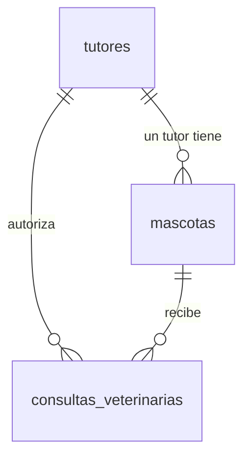

# Set 02 — Consultas y análisis 🔍

En el [Set 01](../01-veterinaria/README.md) **construiste** la base de datos de la veterinaria:
`tutores`, `mascotas` y `consultas_veterinarias`. Ahora vas a **sacarle provecho**: aprenderás
a hacerle *preguntas* a tus datos y obtener respuestas útiles.

> 🎯 La idea de este set: pasar de "guardar datos" a "**entender** los datos". Filtrar,
> ordenar, contar, agrupar y combinar tablas para responder preguntas reales de un negocio.

> **Requisito:** haber completado el **Set 01** y tener pgAdmin conectado a la base
> `veterinariadb`. Si aún no llegas ahí, sigue el [README principal](../../README.md).
>
> 🛟 **¿La base se reinició y perdiste tus tablas?** Es normal: el entorno puede volver a su
> estado inicial al reconstruir el codespace. Por eso este set empieza ejecutando
> [`setup.sql`](setup.sql), que reconstruye las 3 tablas con datos en segundos. No dependes de
> tu trabajo anterior para avanzar.

## Ruta de aprendizaje

| # | Ejercicio | Aprendes | Pregunta que responderás |
|---|---|---|---|
| 1 | **[Filtrar y ordenar](paso1.md)** | `WHERE` (AND/OR/BETWEEN/IN/LIKE), `ORDER BY`, `LIMIT`, `DISTINCT`, `DELETE` | "¿Qué perros mayores de 2 años tengo?" |
| 2 | **[Contar y agrupar](paso2.md)** | `COUNT/SUM/AVG/MIN/MAX`, `GROUP BY`, `HAVING` | "¿Cuántas mascotas hay por especie? ¿Cuánto se facturó?" |
| 3 | **[JOINs y preguntas reales](paso3.md)** | `LEFT JOIN`, JOIN + agregación, subconsultas | "¿Qué mascotas nunca vinieron? ¿Cuánto gastó cada tutor?" |

> 💡 El **paso 1 empieza ejecutando [`setup.sql`](setup.sql)** para dejar la base con datos
> variados (8 mascotas, 9 consultas). No te saltes ese paso.

## Modelo de datos

Trabajas sobre **las mismas 3 tablas** del Set 01 (no creas tablas nuevas):

> 📖 ¿No entiendes la simbología (`PK`, `FK`, `||--o{`)? Está explicada en
> **[Cómo leer el diagrama](../01-veterinaria/erd.md)**.

## Cómo trabajar

1. Abre el **Query Tool** en pgAdmin sobre la base `veterinariadb`.
2. Lee cada micro-paso, escribe el SQL y ejecútalo (▶ o `F5`).
3. Intenta resolver tú primero; si te atascas, despliega **👀 Ver solución**.

## 📤 Entrega

Cada ejercicio se entrega con tu script `.sql` y una captura del resultado.
Lee las instrucciones completas en **[Entrega de los ejercicios](ENTREGA.md)**.

> 💡 ¿Algo salió mal? Tus errores **no rompen nada**. Puedes volver a correr el paso 1 para
> recargar datos, o pedirle a tu instructor reiniciar el entorno.
