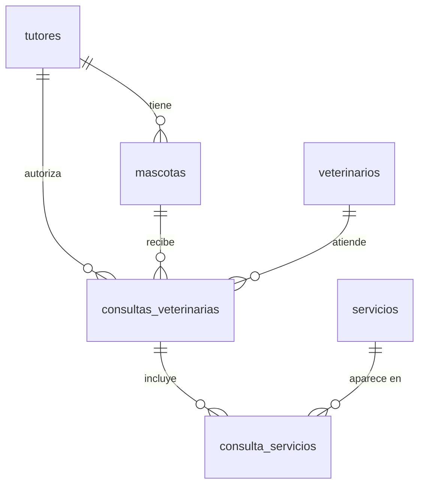

# Set 03 — Haciendo crecer el modelo 🌱

Tu veterinaria ya funciona: tienes `tutores`, `mascotas` y `consultas_veterinarias`, y sabes
consultarlas. Pero la vida real es más rica: **¿quién atiende cada consulta?** y **¿qué
servicios incluye** (vacuna, examen, baño…)? En este set harás **crecer** el modelo para
responder eso, aprendiendo el concepto relacional más importante que aún te falta:
la relación **muchos-a-muchos**.

> 🎯 La idea de este set: pasar de "modelar lo básico" a "modelar como en un sistema real":
> modificar tablas que ya existen, añadir reglas de calidad a los datos y conectar tablas con
> una **tabla puente**.

> **Requisito:** haber completado los Sets 01 y 02 y tener pgAdmin conectado a `veterinariadb`.
>
> 🛟 **Empieza ejecutando [`setup.sql`](setup.sql)**: deja la base en el estado "Set 02
> terminado" (las 3 tablas con datos), así arrancas desde un punto conocido aunque tu base se
> haya reiniciado.

## Ruta de aprendizaje

| # | Ejercicio | Aprendes | Tú haces |
|---|---|---|---|
| 1 | **[Modifica una tabla viva](paso1.md)** | `ALTER TABLE`, `CHECK`, `DEFAULT` | Crear `veterinarios` y enlazarla a las consultas que ya existen |
| 2 | **[Muchos a muchos](paso2.md)** | Tabla puente, clave primaria compuesta, `UNIQUE` | Crear `servicios` y conectarla con `consultas` |
| 3 | **[El reporte completo](paso3.md)** | `JOIN` de 4-5 tablas + `GROUP BY` | Responder preguntas de negocio sobre el modelo crecido |

## El modelo que vas a construir

Partes de las 3 tablas de la izquierda y agregas las **3 nuevas** (`veterinarios`, `servicios`
y la tabla puente `consulta_servicios`):

> 🔑 **Lo nuevo:** una consulta puede incluir **muchos** servicios, y un servicio puede estar en
> **muchas** consultas. Eso es una relación **muchos-a-muchos (N:M)**, y NO se puede resolver con
> una sola FK: necesita una **tabla puente** (`consulta_servicios`) en el medio. Ese es el
> corazón de este set.

> 📖 ¿No entiendes la simbología (`PK`, `FK`, `||--o{`)? Está explicada en
> **[Cómo leer el diagrama](../01-veterinaria/erd.md)**.

## Cómo trabajar

1. Abre el **Query Tool** en pgAdmin sobre la base `veterinariadb`.
2. Ejecuta [`setup.sql`](setup.sql) (solo la primera vez o si quieres reiniciar).
3. Lee cada micro-paso, escribe el SQL y ejecútalo (▶ o `F5`).
4. Intenta resolver tú primero; si te atascas, despliega **👀 Ver solución**.

## 📤 Entrega

Cada ejercicio se entrega con tu script `.sql` y una captura del resultado.
Lee las instrucciones completas en **[Entrega de los ejercicios](ENTREGA.md)**.
